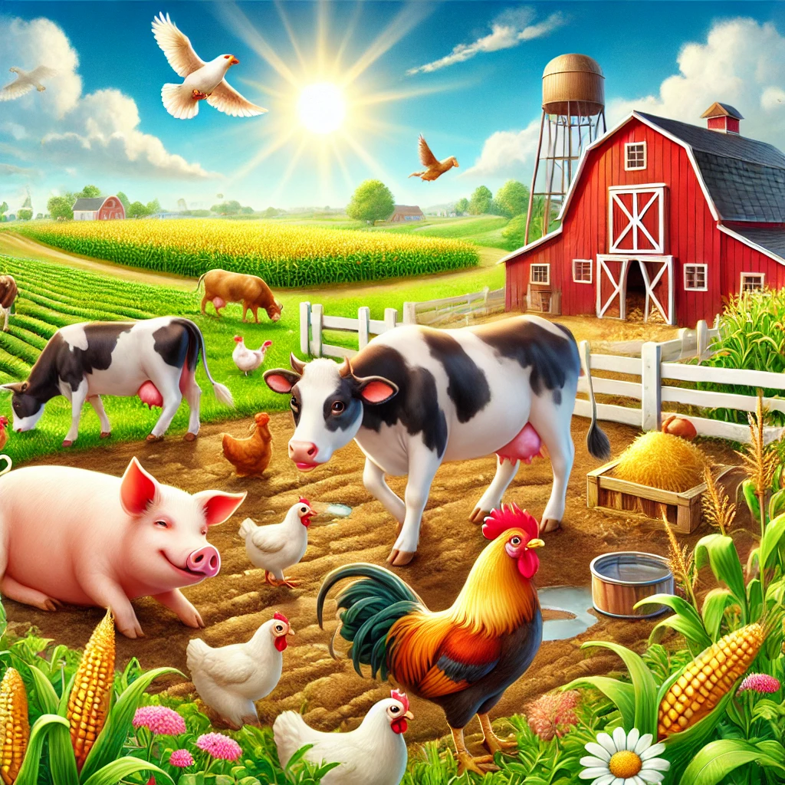

# **Farm Management System**


---

## **Objective:**
This lab focuses on **object-oriented programming (OOP) principles** using **inheritance, polymorphism, aggregation, and composition**. You will build a **Farm Management System** in C++ that models fields containing crops and animals on a farm. You will also practice **reading from CSV files**, managing **dynamic memory**, and **modular code organization**.

By the end of the lab, you will understand:
- How to create classes with appropriate attributes and methods.
- How to use inheritance and polymorphism with abstract classes.
- How to design fields using composition (each field containing one crop).
- How to read data from CSV files to populate your farm.

---

## **Project Overview**

### **Farm System Design**
- **Fields** contain **one crop** each and store their size in acres.
- **Crops** include attributes like **yield per acre** and **price per unit** to calculate **total crop value**.
- The farm stores **multiple animals** and **fields**.
- **Animals** are dynamically allocated and their dietary requirements are determined using **polymorphism** (derived classes for Cow, Chicken, and Pig).
- **File input** is used to load crop and animal data from **CSV files**.

---
**Grading rubric (100 points possible (60 autograded))**

| Points | Requirements                |
|--------|-----------------------------|
| 15     | Animal Classes (Autograded) |
| 15     | Crop Class  (Autograded)    |
| 15     | Field Class (Autograded)    |
| 15     | Farm Class  (Autograded)    |
| 15     | Farm Driver                 |
| 30     | Good coding practices.      |


---

## **Project Structure:**

Use the following files in the Farm directory:

### **Header Files (`.h`):**
- **`Crop.h`**
- **`Field.h`**
- **`Animal.h`**
- **`Cow.h`**
- **`Chicken.h`**
- **`Pig.h`**
- **`Farm.h`**

### **Source Files (`.cpp`):**
- **`Crop.cpp`**
- **`Field.cpp`**
- **`Animal.cpp`**
- **`Cow.cpp`**
- **`Chicken.cpp`**
- **`Pig.cpp`**
- **`Farm.cpp`**
- **`FarmDriver.cpp`**

### **Data Files:**
- **`data/crops.csv`**
- **`data/animals.csv`**

---

## **Class Descriptions and Requirements**

### **1. Crop Class**
**Purpose:** Models a crop with relevant attributes like name, yield per acre, and price per unit.  
**File:** `Crop.h` and `Crop.cpp`

**Attributes:**
- **`name`**: Name of the crop (e.g., "Corn").
- **`harvestTime`**: Number of days required for harvest.
- **`yieldPerAcre`**: Units produced per acre.
- **`pricePerUnit`**: Price per unit of yield.

**Methods:**
- **Constructor:**
  `Crop(std::string cropName, int harvestTime, double yield, double price);`
   Initializes the crop’s attributes with the given parameters.

- **`displayInfo()`**:  
  Returns a string summarizing the crop's details.

- **`getYieldPerAcre()`**:  
  Returns the yield per acre as a double.

- **`getPricePerUnit()`**:  
  Returns the price per unit as a double.

---

### **2. Field Class**
**Purpose:** Models a field that contains a **single crop** and stores its size in acres.  
**File:** `Field.h` and `Field.cpp`

**Attributes:**
- **`crop`**: A `Crop` object.
- **`sizeInAcres`**: Size of the field in acres.

**Methods:**
- **Constructor:**
  `Field(std::string cropName, int harvestTime, double yield, double price, double sizeInAcres);`
  Initializes the field using **an initializer list** to set the crop.

- **`toString()`**:  
  Returns a string summarizing the crop details, field size, and total value.

- **`totalYield()`**:  
  Calculates and returns the total crop yield based on the field size.

- **`totalValue()`**:  
  Calculates and returns the total value based on the total yield and price per unit.

---

### **3. Animal Class (Abstract Class)**
**Purpose:** Base class for all animals on the farm.  
**File:** `Animal.h` and `Animal.cpp`

**Attributes:**
- **`name`**: The animal’s name.
- **`weight`**: Weight of the animal in kilograms.

**Methods:**
- **Constructor:**
  `Animal(std::string animalName, double weight);`
  Initializes the animal's attributes.

- **`virtual std::string toString() const;`**  
  Returns a string summarizing the animal’s details.

- **`virtual std::string dietaryRequirements() const = 0;`**  
  A pure virtual function that must be implemented by all derived classes.

---

### **4. Derived Animal Classes (Cow, Chicken, and Pig)**
Each derived class provides its own **dietary requirements**.

#### **Cow Class**
**Constructor:**
`Cow(std::string name, double weight);`
**Dietary Requirement:**  
"Requires 2.5 kg of grass per kg of body weight."

#### **Chicken Class**
**Constructor:**
`Chicken(std::string name, double weight);`

**Dietary Requirement:**  
"Requires 0.1 kg of grain per kg of body weight."

#### **Pig Class**
**Constructor:**
`Pig(std::string name, double weight);`

**Dietary Requirement:**  
"Requires 0.05 kg of mixed feed per kg of body weight."

---

### **5. Farm Class**
**Purpose:** contains multiple **fields and animals**.  
**File:** `Farm.h` and `Farm.cpp`

**Attributes:**
- A **vector of `Field` objects** storing all fields.
- A **vector of `Animal*` pointers** storing dynamically allocated animals.

**Methods:**
- **Destructor:**  
  Since Fields held directly in the Farm object (not via pointers) the destructor does not need to actively delete them.  The animal relationship should be aggregation which means the Farm class is not responsible for deleting the animal objects.  However, you should be sure that your driver deletes the animals if needed to prevent memory leaks. 

- **`addField(const Field& field);`**  
  Adds a field to the farm.

- **`addAnimal(Animal* animal);`**  
  Adds an animal to the farm.

- **`toString() const;`**  
  Returns a string summarizing all the fields and animals on the farm.

- **`totalFarmYield() const;`**  
  Calculates and returns the total yield from all fields.

---

## **FarmDriver.cpp Instructions**

1. **Setup:**
    - The `FarmDriver.cpp` program serves as the entry point for the **Farm Management System**.
    - It reads data from two **CSV files**:
        - **`data/crops.csv`** – Contains crop and field information.
        - **`data/animals.csv`** – Contains animal details.

2. **Functionality Breakdown:**  
   The `FarmDriver` performs the following actions:

    1. **Reads Crop Data:**
        - Opens **`data/crops.csv`**.
        - For each row:
            - Extracts **crop name, harvest time, yield per acre, price per unit, and field size**.
            - Creates a `Field` object with the crop and adds it to the farm.

    2. **Reads Animal Data:**
        - Opens **`data/animals.csv`**.
        - For each row:
            - Extracts **animal type, name, and weight**.
            - Dynamically allocates the appropriate animal (`Cow`, `Chicken`, or `Pig`).
            - Adds the animal to the farm.

    3. **Displays Farm Details:**
        - Prints:
            - **All fields** with crop information and **total value**.
            - **All animals** with their dietary requirements.
        - Displays the **total farm yield** from all fields.

---

## **FarmDriver.cpp Outline**

1. **Include Headers:**
    - Include necessary headers for the **farm components**:
        - `Farm.h`
        - `Cow.h`, `Chicken.h`, `Pig.h`
        - `<fstream>` and `<sstream>` for file handling.

2. **Declare Functions:**
    - **`readCropsFromFile()`**:  
      Reads crop data from **`data/crops.csv`** and creates `Field` objects.
    - **`readAnimalsFromFile()`**:  
      Reads animal data from **`data/animals.csv`** and allocates animals dynamically.

3. **Main Function:**
    - Create a `Farm` object.
    - Call **`readCropsFromFile()`** to populate fields.
    - Call **`readAnimalsFromFile()`** to add animals.
    - Print the farm details and total farm yield.

---

### **FarmDriver.cpp Example Workflow**

1. **Open the CSV Files:**
    - **`data/crops.csv`**:
      ```
      Corn,120,150.0,2.5,10.0
      Wheat,90,100.0,1.8,5.0
      Soybean,130,200.0,3.0,8.0
      ```
    - **`data/animals.csv`**:
      ```
      Cow,Bessie,700.0
      Chicken,Clucky,2.5
      Pig,Porky,150.0
      ```

2. **Create Fields and Animals:**
    - For each crop in **`crops.csv`**:
        - Create a `Field` with the specified crop and size.
        - Add the field to the farm.
    - For each animal in **`animals.csv`**:
        - Dynamically allocate the appropriate animal (`Cow`, `Chicken`, or `Pig`).
        - Add the animal to the farm.

3. **Display Output:**
    - Print a summary of all fields and animals, including:
        - **Total yield** for each field.
        - **Total value** for each field based on yield and price per unit.
        - **Dietary requirements** for each animal.
    - Print the **total farm yield** from all fields.

---

## **Detailed Instructions for FarmDriver.cpp Implementation**

### **Function 1: `readCropsFromFile()`**

- **Purpose:**  
  Reads crop data from the **`data/crops.csv`** file and adds fields to the farm.

- **Parameters:**
  ```cpp
  void readCropsFromFile(const std::string& filename, Farm& farm);
  ```
    - **`filename`**: Path to the crops CSV file.
    - **`farm`**: Reference to the `Farm` object.

- **Implementation Steps:**
    1. Open the file using `std::ifstream`.
    2. For each line:
        - Extract crop name, harvest time, yield per acre, price per unit, and field size.
        - Create a `Field` object with the extracted data.
        - Add the field to the farm using `farm.addField()`.

---

### **Function 2: `readAnimalsFromFile()`**

- **Purpose:**  
  Reads animal data from the **`data/animals.csv`** file and dynamically allocates animals.

- **Parameters:**
  ```cpp
  void readAnimalsFromFile(const std::string& filename, Farm& farm);
  ```
    - **`filename`**: Path to the animals CSV file.
    - **`farm`**: Reference to the `Farm` object.

- **Implementation Steps:**
    1. Open the file using `std::ifstream`.
    2. For each line:
        - Extract the animal type, name, and weight.
        - Dynamically allocate the appropriate animal using `new`.
        - Add the animal to the farm using `farm.addAnimal()`.

---

### **Main Function:**

- **Purpose:**  
  The main function orchestrates the **creation of the farm** by reading data from the CSV files and printing the summary.

- **Implementation Steps:**
    1. Create a `Farm` object.
    2. Call `readCropsFromFile()` to populate the farm with fields.
    3. Call `readAnimalsFromFile()` to add animals to the farm.
    4. Print the farm summary using `farm.toString()`.
    5. Display the total farm yield using `farm.totalFarmYield()`.

---

### **Example Program Output:**

```
Farm Details:

Field size: 10 acres
Crop: Corn, Harvest Time: 120 days, Yield: 150 units per acre, Price: $2.5 per unit
Total Value: $3750

Field size: 5 acres
Crop: Wheat, Harvest Time: 90 days, Yield: 100 units per acre, Price: $1.8 per unit
Total Value: $900

Field size: 8 acres
Crop: Soybean, Harvest Time: 130 days, Yield: 200 units per acre, Price: $3.0 per unit
Total Value: $4800

Animals:
Cow: Bessie, Weight: 700 kg
Dietary Requirements: Requires 1750 kg of grass per day

Chicken: Clucky, Weight: 2.5 kg
Dietary Requirements: Requires 0.25 kg of grain per day

Pig: Porky, Weight: 150 kg
Dietary Requirements: Requires 7.5 kg of mixed feed per day

Total Farm Yield: 4700 units
```
